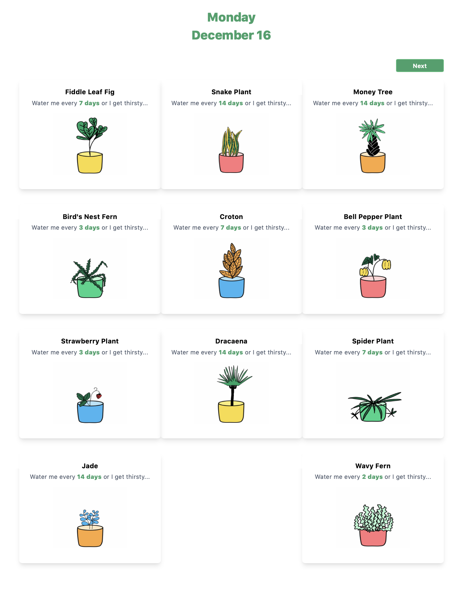
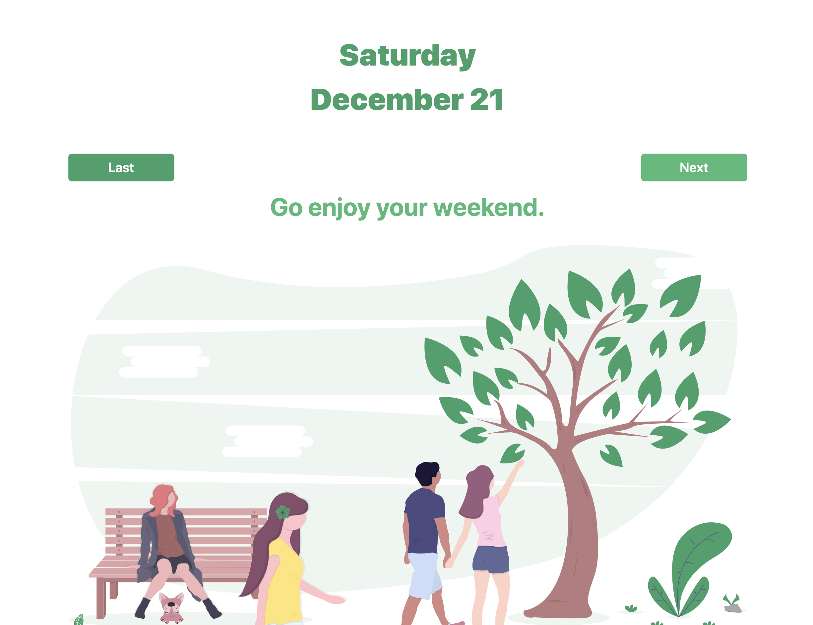
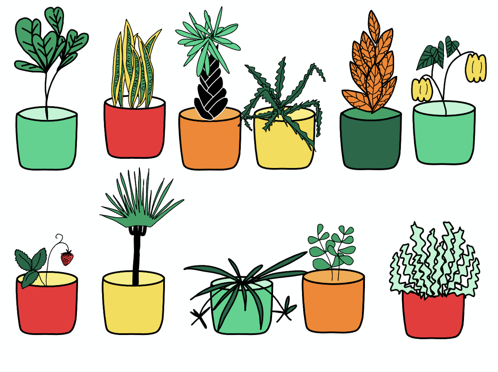

<p align="center">
    
  </a>
</p>
<h1 align="center">
  Welcome to Tandelorian Forest
</h1>

This simple app was designed to help the Tandelorians at Tandem keep track of their ever growing forest of plants. It's tough work keeping track of when to water each one. Hopefully this can help.

This was a project assigned by Tandem as part of the application process for their Apprentice Software Engineer role. The acceptance criteria was as follows:

- The user can view which plant(s) to water on which date(s).
- The schedule covers the next 12 weeks starting next Monday.
- No plants are watered on Saturdays or Sundays.
- Each plant is watered on its desired schedule or as close as possible, taking into account weekends.

_See below a couple ways to use this tool as well as the work that went into creating it._ 

---

## ⚡️ How to get started

1.  **Download or clone the repository to your machine to run it locally.**

> - *Note: this site was built using [Node](https://www.nodejs.org) 10.14.1. If you want to run this locally please use a minimum version of 10.14.1.*


  Navigate to the project directory in your terminal and make sure all of your dependencies are installed.

  ```
  npm install
  ```
  Then you can run the site in Node using 

  ```
  npm start
  ```
  Then in your browser visit `http://localhost:8000`

2.  **Simply visit the deployed website online.**

    Navigate in your browser to [tandelorianforest.netlify.com](https://www.tandelorianforest.netlify.com)

    Here you will find the deployed site.


 
> Here is a glimpse at what the site looks like on day one, which is December 16, 2019. It shows all the plants to be watered as well as the next button to see the following days.


 
> And when you go to check on the plants on the weekend you are met with the friendly reminder to go do something else instead.


 
> 🎨 For each plant I had a custom icons drawn to resemble the real life plants:

## 👟 Next steps if there was more time
The stipulations of the application gave only a week to code this site. Give more time I would:
- Provide the ability to add more plants
- Give more navigation options for moving to different days or months.
- Simplify some of the conditional logic in the click event on the Next/Last buttons.

---

## 🚘 What is running under the hood?

- This site was created with the [React 16.12.0](https://www.reactjs.org). This framework is a component-based JavaScript library used to build user interfaces.

- Built using [Node](https://www.nodejs.org). If you want to run this locally please use a minimum version of 10.14.1.

- For styling I used [Tailwind 1.1.4](https://www.tailwindcss.com) which is a utility-first CSS framework. According to their own site: "Most CSS frameworks do too much." Instead Tailwind supplies low-level utility classes and lets you code the rest.

- To ensure consistency across the application [Prettier 1.19.1](https://prettier.io/) was used for code formatting. 

- This site was spun up using [Gatsby 2.18.8](https://www.gatsbyjs.org/) and many of the dependencies will be related to their default dependencies.

Here is a quick look at the file tree and directories you'll see in this application. Not all are displayed. I've highlighted the most important ones below.

    ├── node_modules
    ├── src
       ├── components
       ├── css
       ├── data
       └── pages
          ├── 404.js
          └── index.js
    ├── static
    ├── .gitignore
    ├── .prettierignore
    ├── .prettierrc
    ├── gatsby-browser.js
    ├── gatsby-config.js
    ├── LICENSE
    ├── package-lock.json
    ├── package.json
    ├── postcss.config.js
    ├── README.md
    └── tailwind.config.js

-  **`/node_modules`**: This directory contains all of the modules of code that your project depends on (npm packages) are automatically installed.

-  **`/src`**: This directory will contain all of the code related to what you will see on the front-end of your site (what you see in the browser) such as your site header or a page template. `src` is a convention for “source code”.

    - **`/components`**: This folder contains all of the modular components used as the building blocks of the site. This includes the plant cards and the plant card container.

    - **`/css`**: This folder contains the tailwind.css file which was used to style the site.

    - **`/data`**: This folder contains the data.json file that was supplied for the coding challenge. Only two modifications were made to each plant. They were each given a key property and an image path property.

    - **`/pages`**: This folder contains all of the pages for the website. The entry point for the site is the index.js file contained here. This is the main page and is the highest parent component.

- **`/static`**: This folder is used to hold svg images for each plant. The reference is held in the data.json file.

-  **`gatsby-browser.js`**: This file is where Gatsby imports the Tailwind dependency.

-  **`LICENSE`**: This site is licensed under the MIT license.

- **`package.json`**: A manifest file for Node.js projects, which includes things like metadata (the project’s name, author, etc). This manifest is how npm knows which packages to install for your project.

- **`postcss.config.js`**: This file is used to configure the plugin for Tailwind.

- **`README.md`**: A text file containing useful reference information about the project. You're reading it now. 😉

- **`tailwind.config.js`**: This file contains any modifications or configurations made by the developer to the Tailwind rules. The only changes I made were to add an extra small screen size.


## 🚀 Deployed With Netlify

- Learn more about deploying your code to Netlify

  [](https://app.netlify.com/start/deploy?repository=https://github.com/gatsbyjs/gatsby-starter-default)

## 👋 Want to learn more?

- **Looking for more of my work?** Most of my code lives [on my github](https://www.github.org/cm718).

- **If you live around Chicago and would like to grab coffee** to discuss _coding, good food, or board games_ please [email me](mailto:info@chrismclaughlin.dev).

- And if you read this far -- *thank you*! 🙏